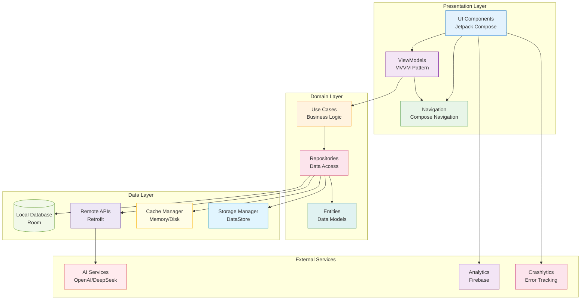
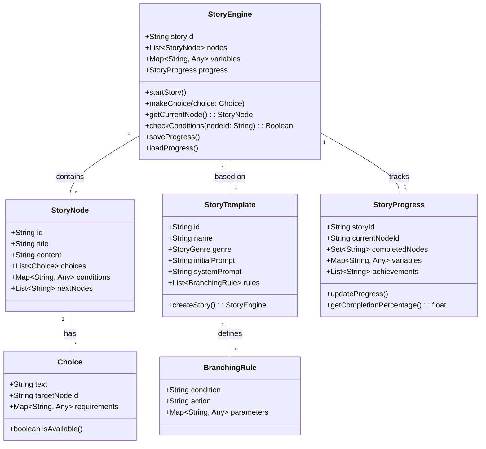
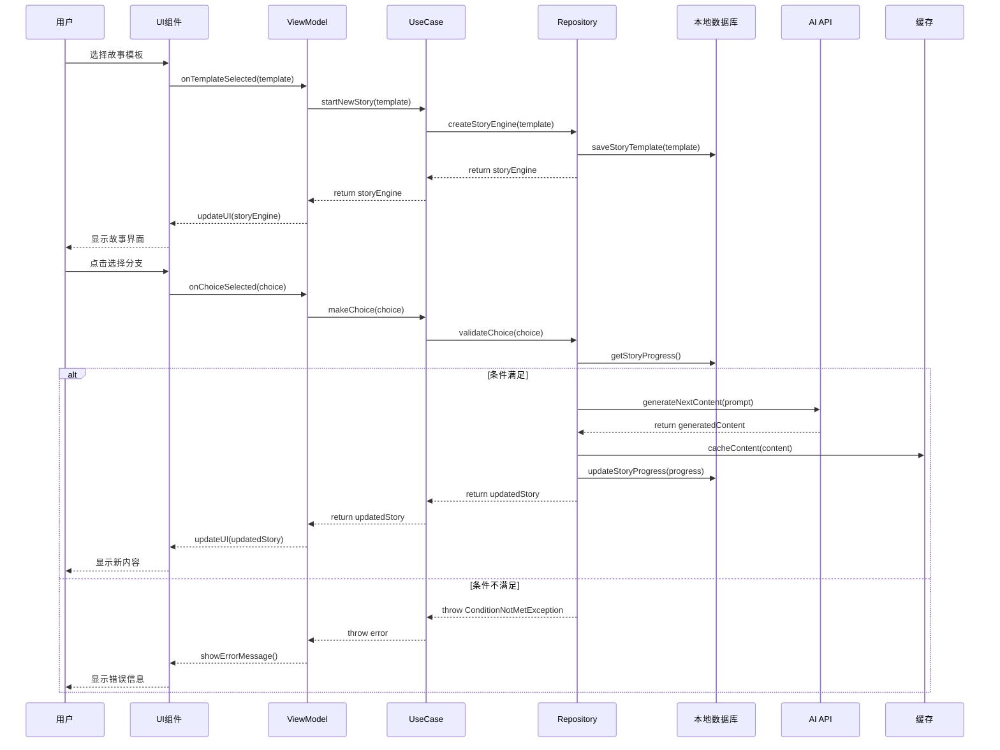
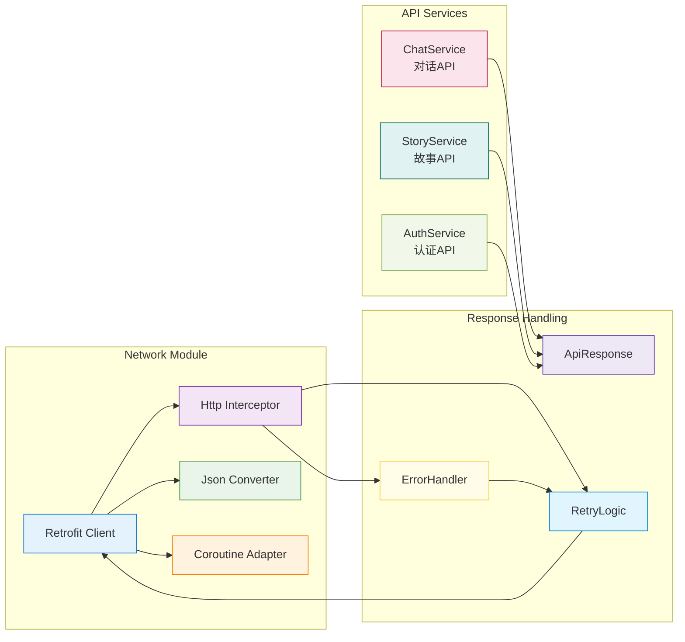
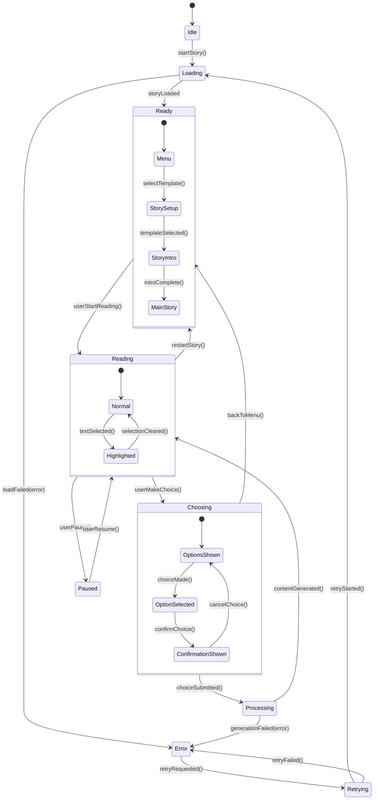

# AI Story Weaver 系统架构设计

## 1. 整体架构概览

## 2. 核心模块详细设计

### 2.1 故事引擎模块

### 2.2 数据流设计

### 2.3 网络层设计

### 2.4 状态管理设计

## 3. 关键技术决策

### 3.1 架构模式选择
- **MVVM**: 清晰的关注点分离，便于测试和维护
- **Repository模式**: 抽象数据源，支持多数据源切换
- **UseCase模式**: 封装业务逻辑，提高代码复用性

### 3.2 技术栈选择
- **Jetpack Compose**: 现代化的声明式UI框架
- **Room**: 类型安全的SQLite数据库
- **Retrofit**: 灵活的HTTP客户端
- **Hilt**: 依赖注入框架
- **Coroutines**: 异步编程
- **Flow**: 响应式数据流

### 3.3 性能优化策略
- **懒加载**: 按需加载故事内容
- **缓存机制**: 内存+磁盘两级缓存
- **分页加载**: 大文本分块显示
- **预加载**: 预测用户行为提前加载
- **压缩传输**: 减少网络流量

## 4. 安全考虑

### 4.1 数据安全
- **本地加密**: 敏感数据AES加密存储
- **传输安全**: HTTPS + Certificate Pinning
- **权限控制**: 最小权限原则
- **数据清理**: 及时清理临时文件

### 4.2 内容安全
- **输入过滤**: 防止XSS攻击
- **输出过滤**: 内容安全审查
- **速率限制**: 防止API滥用
- **日志脱敏**: 保护用户隐私

## 5. 监控和运维

### 5.1 应用监控
- **崩溃监控**: Firebase Crashlytics
- **性能监控**: Android Vitals
- **用户行为**: Firebase Analytics
- **自定义指标**: 关键业务指标追踪

### 5.2 运维工具
- **CI/CD**: GitHub Actions
- **代码质量**: SonarQube
- **依赖管理**: Dependabot
- **文档生成**: Dokka

---

**架构版本**: 1.0
**创建时间**: 2026-03-28
**最后更新**: 2026-03-28
**维护人**: 架构师