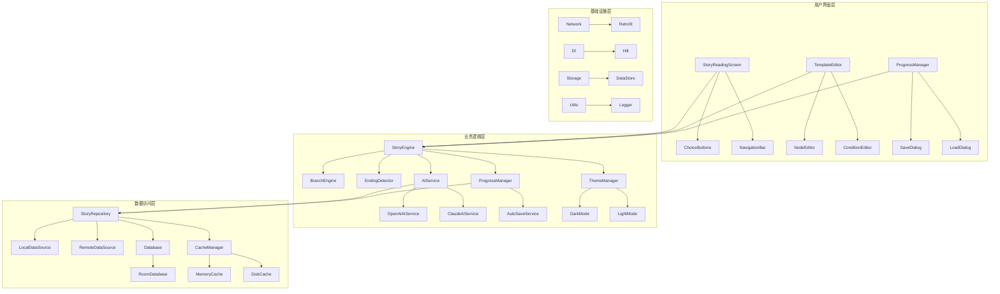
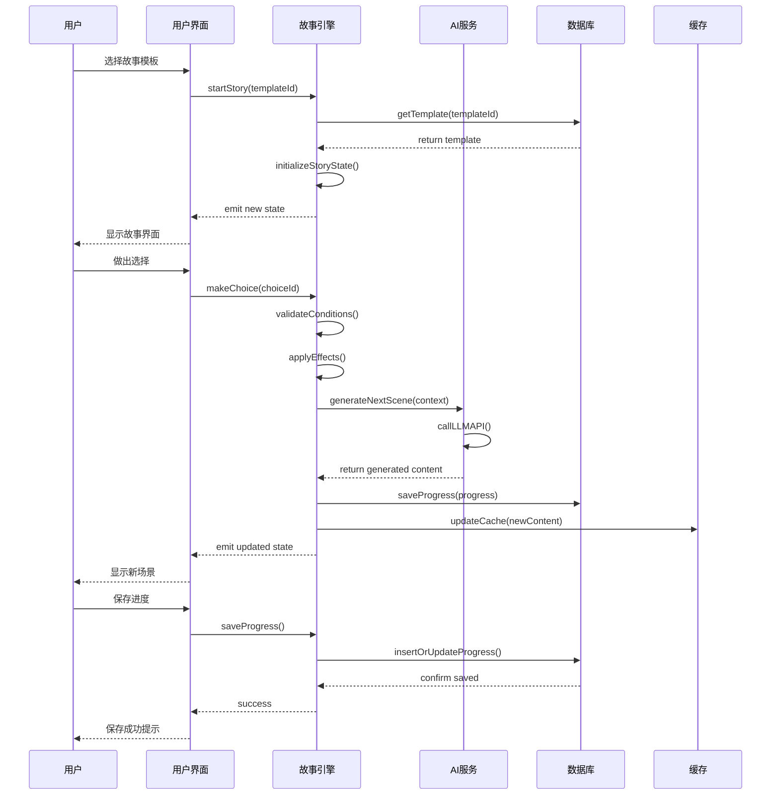
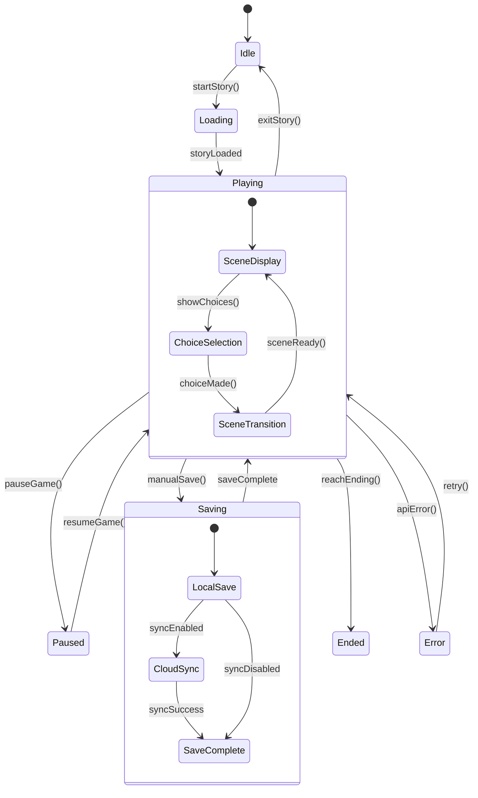
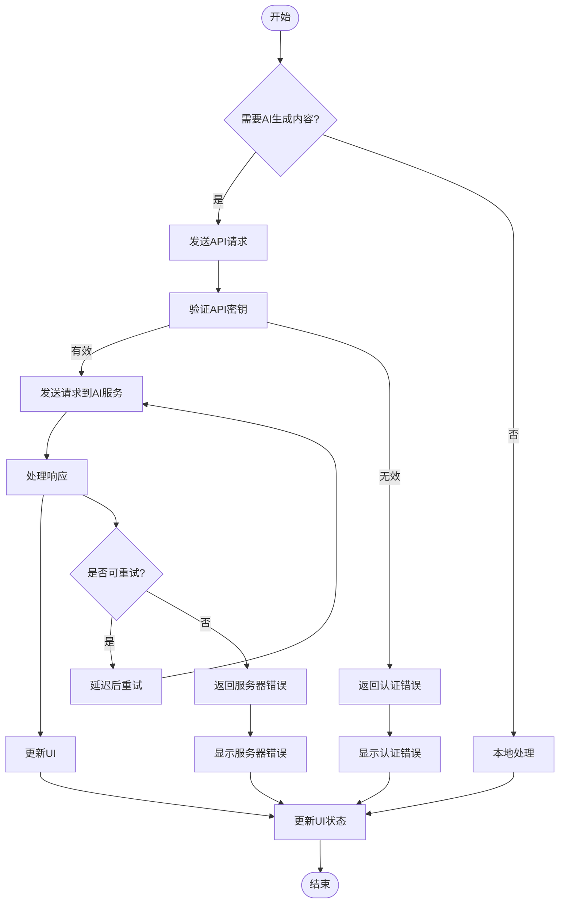
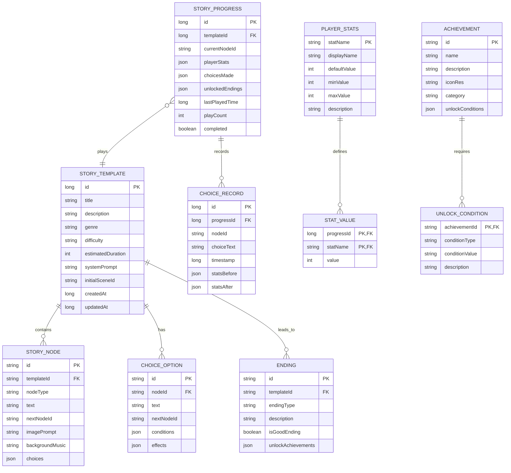
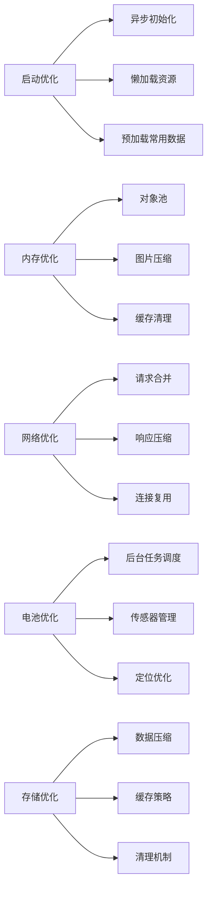

# AI Story Weaver 架构设计图

## 系统架构总览

```mermaid
graph TB
    subgraph "用户界面层"
        A[StoryReadingScreen] --> B[ChoiceButtons]
        A --> C[NavigationBar]
        D[TemplateEditor] --> E[NodeEditor]
        D --> F[ConditionEditor]
        G[ProgressManager] --> H[SaveDialog]
        G --> I[LoadDialog]
    end

    subgraph "业务逻辑层"
        J[StoryEngine] --> K[BranchEngine]
        J --> L[EndingDetector]
        M[AIService] --> N[OpenAIAIService]
        M --> O[ClaudeAIService]
        P[ProgressManager] --> Q[AutoSaveService]
        R[ThemeManager] --> S[DarkMode]
        R --> T[LightMode]
    end

    subgraph "数据访问层"
        U[StoryRepository] --> V[LocalDataSource]
        U --> W[RemoteDataSource]
        X[Database] --> Y[RoomDatabase]
        Z[CacheManager] --> AA[MemoryCache]
        Z --> AB[DiskCache]
    end

    subgraph "基础设施层"
        AC[Network] --> AD[Retrofit]
        AE[DI] --> AF[Hilt]
        AG[Storage] --> AH[DataStore]
        AI[Utils] --> AJ[Logger]
    end

    A --> J
    D --> J
    G --> J
    J --> M
    J --> P
    J --> R
    M --> U
    P --> U
    U --> X
    U --> Z
```

## 数据流图

```mermaid
sequenceDiagram
    participant User as 用户
    participant UI as 用户界面
    participant Engine as 故事引擎
    participant AI as AI服务
    participant DB as 数据库
    participant Cache as 缓存

    User->>UI: 选择故事模板
    UI->>Engine: startStory(templateId)
    Engine->>DB: getTemplate(templateId)
    DB-->>Engine: return template
    Engine->>Engine: initializeStoryState()
    Engine-->>UI: emit new state
    UI-->>User: 显示故事界面

    User->>UI: 做出选择
    UI->>Engine: makeChoice(choiceId)
    Engine->>Engine: validateConditions()
    Engine->>Engine: applyEffects()
    Engine->>AI: generateNextScene(context)
    AI->>AI: callLLMAPI()
    AI-->>Engine: return generated content
    Engine->>DB: saveProgress(progress)
    Engine->>Cache: updateCache(newContent)
    Engine-->>UI: emit updated state
    UI-->>User: 显示新场景

    User->>UI: 保存进度
    UI->>Engine: saveProgress()
    Engine->>DB: insertOrUpdateProgress()
    DB-->>Engine: confirm saved
    Engine-->>UI: success
    UI-->>User: 保存成功提示
```

## 模块依赖关系

```mermaid
classDiagram
    class StoryEngine {
        +startStory(templateId): Result
        +makeChoice(choiceId): Result
        +saveProgress(): Unit
        +loadProgress(progressId): Result
    }

    class BranchEngine {
        +evaluateChoices(state, choices): List~ValidChoice~
        +calculateWeights(choice, state): Float
        +validateConditions(conditions, stats): Boolean
    }

    class AIService {
        <<interface>>
        +generateStoryContent(context, prompt): Result~String~
        +evaluateChoices(currentScene, stats, choices): Result~List~ChoiceEvaluation~~
    }

    class OpenAIAIService {
        -chatApi: ChatApi
        +generateStoryContent(context, prompt): Result~String~
        +evaluateChoices(currentScene, stats, choices): Result~List~ChoiceEvaluation~~
    }

    class ProgressManager {
        +autoSave(): Unit
        +manualSave(): Unit
        +syncToCloud(): Result
        +getHistory(): List~ProgressRecord~
    }

    class ThemeManager {
        +setTheme(themeType): Unit
        +getCurrentTheme(): ThemeConfig
        +applyAnimation(animationType): AnimationSpec
    }

    class StoryRepository {
        -localDataSource: LocalDataSource
        -remoteDataSource: RemoteDataSource
        +getTemplate(id): StoryTemplate
        +saveProgress(progress): Unit
        +getAllTemplates(): List~StoryTemplate~
    }

    class LocalDataSource {
        +getTemplate(id): StoryTemplate?
        +saveProgress(progress): Unit
        +getAllProgress(): List~StoryProgress~
    }

    class RemoteDataSource {
        +uploadProgress(progress): Result
        +downloadTemplates(): Result~List~StoryTemplate~~
    }

    class CacheManager {
        +put(key, value): Unit
        +get(key): T?
        +clearExpired(): Unit
    }

    StoryEngine --> BranchEngine
    StoryEngine --> AIService
    StoryEngine --> ProgressManager
    StoryEngine --> ThemeManager

    AIService <|.. OpenAIAIService
    StoryRepository --> LocalDataSource
    StoryRepository --> RemoteDataSource
    StoryRepository --> CacheManager
```

## 状态管理图

```mermaid
stateDiagram-v2
    [*] --> Idle
    Idle --> Loading: startStory()
    Loading --> Playing: storyLoaded
    Playing --> Paused: pauseGame()
    Paused --> Playing: resumeGame()
    Playing --> Saving: manualSave()
    Saving --> Playing: saveComplete
    Playing --> Ended: reachEnding()
    Playing --> Error: apiError()
    Error --> Playing: retry()
    Playing --> Idle: exitStory()

    state Playing {
        [*] --> SceneDisplay
        SceneDisplay --> ChoiceSelection: showChoices()
        ChoiceSelection --> SceneTransition: choiceMade()
        SceneTransition --> SceneDisplay: sceneReady()
    }

    state Saving {
        [*] --> LocalSave
        LocalSave --> CloudSync: syncEnabled
        CloudSync --> SaveComplete: syncSuccess
        LocalSave --> SaveComplete: syncDisabled
    }
```

## 网络请求流程

```mermaid
flowchart TD
    Start([开始]) --> Request{需要AI生成内容?}
    Request -->|是| APIRequest[发送API请求]
    Request -->|否| LocalProcess[本地处理]

    APIRequest --> Validate[验证API密钥]
    Validate -->|有效| SendRequest[发送请求到AI服务]
    Validate -->|无效| Error401[返回认证错误]

    SendRequest --> ProcessResponse[处理响应]
    ProcessResponse --> Success[更新UI]
    ProcessResponse --> Retry{是否可重试?}

    Retry -->|是| Delay[延迟后重试]
    Retry -->|否| Error500[返回服务器错误]

    Delay --> SendRequest
    Error401 --> ShowAuthError[显示认证错误]
    Error500 --> ShowServerError[显示服务器错误]

    LocalProcess --> UpdateUI[更新UI状态]
    Success --> UpdateUI
    ShowAuthError --> UpdateUI
    ShowServerError --> UpdateUI

    UpdateUI --> End([结束])
```

## 数据库设计图

```mermaid
erDiagram
    STORY_TEMPLATE ||--o{ STORY_NODE : contains
    STORY_TEMPLATE ||--o{ CHOICE_OPTION : has
    STORY_TEMPLATE ||--o{ ENDING : leads_to
    STORY_PROGRESS ||--o{ CHOICE_RECORD : records
    STORY_PROGRESS }o--|| STORY_TEMPLATE : plays
    PLAYER_STATS ||--o{ STAT_VALUE : defines
    ACHIEVEMENT ||--o{ UNLOCK_CONDITION : requires

    STORY_TEMPLATE {
        long id PK
        string title
        string description
        string genre
        string difficulty
        int estimatedDuration
        string systemPrompt
        string initialSceneId
        long createdAt
        long updatedAt
    }

    STORY_NODE {
        string id PK
        string templateId FK
        string nodeType
        string text
        string nextNodeId
        string imagePrompt
        string backgroundMusic
        json choices
    }

    CHOICE_OPTION {
        string id PK
        string nodeId FK
        string text
        string nextNodeId
        json conditions
        json effects
    }

    ENDING {
        string id PK
        string templateId FK
        string endingType
        string description
        boolean isGoodEnding
        json unlockAchievements
    }

    STORY_PROGRESS {
        long id PK
        long templateId FK
        string currentNodeId
        json playerStats
        json choicesMade
        json unlockedEndings
        long lastPlayedTime
        int playCount
        boolean completed
    }

    CHOICE_RECORD {
        long id PK
        long progressId FK
        string nodeId
        string choiceText
        long timestamp
        json statsBefore
        json statsAfter
    }

    PLAYER_STATS {
        string statName PK
        string displayName
        int defaultValue
        int minValue
        int maxValue
        string description
    }

    STAT_VALUE {
        long progressId PK,FK
        string statName PK,FK
        int value
    }

    ACHIEVEMENT {
        string id PK
        string name
        string description
        string iconRes
        string category
        json unlockConditions
    }

    UNLOCK_CONDITION {
        string achievementId PK,FK
        string conditionType
        string conditionValue
        string description
    }
```

## 性能优化策略

```mermaid
graph LR
    A[启动优化] --> B[异步初始化]
    A --> C[懒加载资源]
    A --> D[预加载常用数据]

    E[内存优化] --> F[对象池]
    E --> G[图片压缩]
    E --> H[缓存清理]

    I[网络优化] --> J[请求合并]
    I --> K[响应压缩]
    I --> L[连接复用]

    M[电池优化] --> N[后台任务调度]
    M --> O[传感器管理]
    M --> P[定位优化]

    Q[存储优化] --> R[数据压缩]
    Q --> S[缓存策略]
    Q --> T[清理机制]
```

这个架构设计图完整地展示了AI Story Weaver的系统架构、数据流、模块依赖关系和关键流程，为开发团队提供了清晰的技术蓝图。