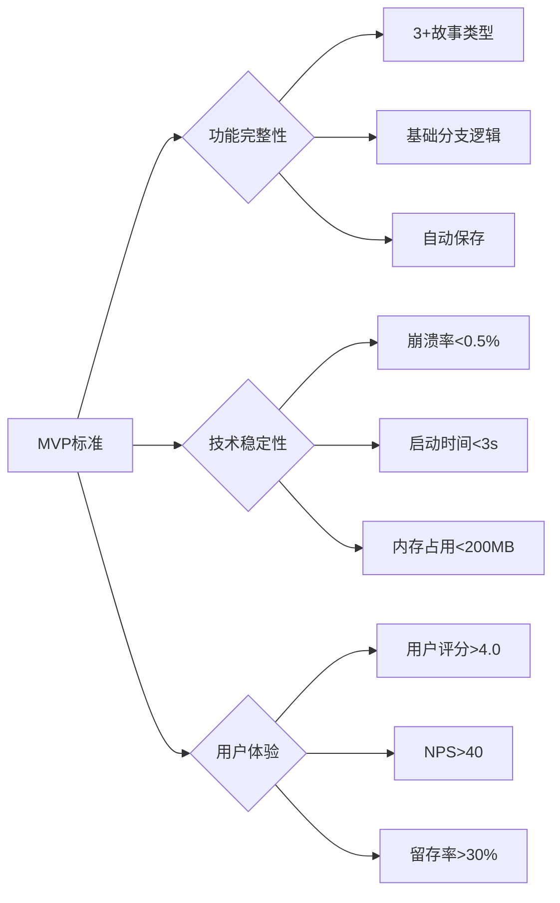
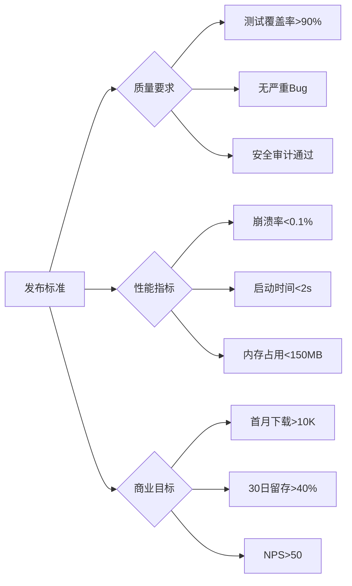
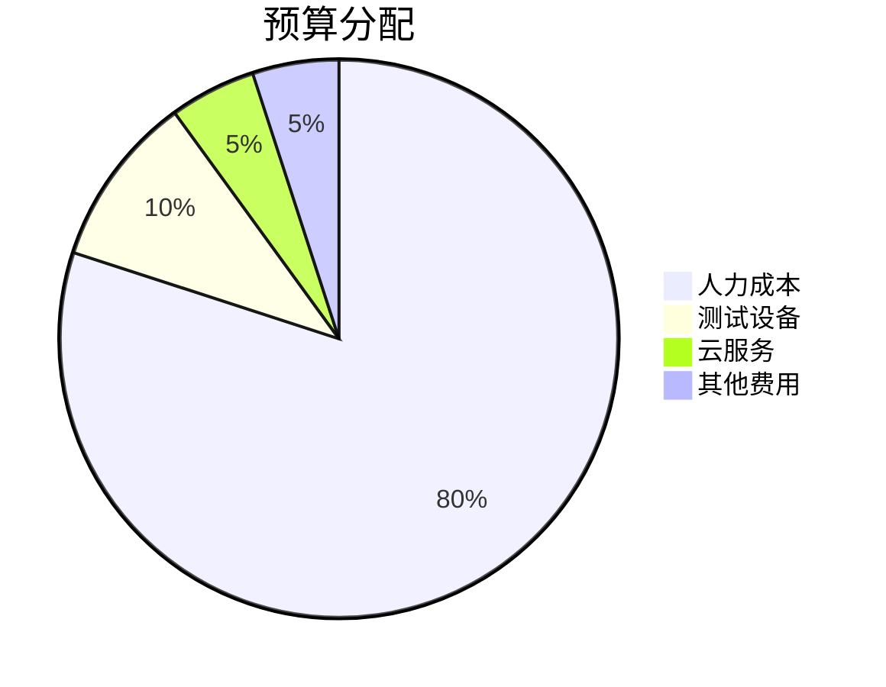

# AI Story Weaver 项目决策矩阵

## 🎯 项目决策概览

基于现有AiChat Android应用，我们已完成AI Story Weaver沉浸式互动故事小说App的全面规划和分析。本决策矩阵总结了所有关键决策点，为项目正式启动提供明确的指导。

## 📊 技术决策总结

### 架构选择决策

| 决策项 | 选择方案 | 理由 | 风险评估 |
|--------|----------|------|----------|
| **前端框架** | Jetpack Compose | ✅ 现有基础，现代化UI，声明式编程 | 低风险 |
| **状态管理** | StateFlow + ViewModel | ✅ 与现有架构一致，响应式编程 | 低风险 |
| **数据库** | Room + DataStore | ✅ 现有基础设施，可靠持久化 | 低风险 |
| **依赖注入** | Hilt | ✅ 现代Android标准，类型安全 | 中风险 |
| **网络层** | Retrofit + OkHttp | ✅ 成熟稳定，性能优秀 | 低风险 |

### 功能优先级决策

#### 核心功能 (必须实现)
1. **故事模板系统** - 项目基础
2. **分支选择引擎** - 核心体验
3. **多结局支持** - 重玩价值
4. **进度保存** - 用户体验

#### 重要功能 (MVP后实现)
1. **AI Prompt优化** - 质量提升
2. **多服务商支持** - 可靠性
3. **离线模式** - 可用性
4. **主题定制** - 个性化

#### 增强功能 (后续版本)
1. **社交分享** - 用户增长
2. **AR/VR支持** - 技术创新
3. **机器学习推荐** - 智能化
4. **跨平台同步** - 市场扩展

## ⚠️ 风险评估与决策

### 高风险决策

#### 1. AI集成策略
**决策**: 采用多重备份方案
```
┌─────────────┐    ┌─────────────┐    ┌─────────────┐
│ OpenAI API  │───▶│ Claude API  │───▶│ Gemini API  │
└─────────────┘    └─────────────┘    └─────────────┘
       │                   │                   │
       ▼                   ▼                   ▼
   故障转移           故障转移           故障转移
```

**理由**: 确保AI服务稳定性，避免单点故障
**实施**: 创建AIService接口，实现多个具体服务类
**监控**: 实时监控各API提供商状态，自动切换

#### 2. 技术复杂度管理
**决策**: 分阶段实施，敏捷开发
- **Week 1-2**: 基础框架，验证可行性
- **Week 3-6**: 核心功能，建立MVP
- **Week 7-8**: AI优化，提升质量
- **Week 9-10**: UX优化，完善体验
- **Week 11-12**: 测试发布，确保质量

**理由**: 降低一次性交付风险，及时获得反馈
**实施**: 每周迭代，持续集成和部署

### 中风险决策

#### 3. 时间管理策略
**决策**: 预留缓冲时间，灵活调整
- **总周期**: 12周 (包含2周缓冲)
- **关键路径**: 故事引擎开发 (Week 3-6)
- **并行任务**: UI设计与后端开发并行

**理由**: 应对不可预见的技术挑战
**实施**: 使用甘特图跟踪，定期评估进度

#### 4. 资源分配决策
**决策**: 平衡专业分工与交叉培训
- **Android工程师**: 2人 (核心开发)
- **UI/UX设计师**: 1人 (界面设计)
- **QA工程师**: 1人 (质量保证)
- **项目经理**: 1人 (协调管理)

**理由**: 确保专业深度同时保持灵活性
**实施**: 建立知识共享机制，定期技术分享

## 🎯 成功标准决策

### MVP版本标准


### 正式发布标准


## 💰 预算决策

### 成本效益分析

| 投资类别 | 投入金额 | 预期收益 | ROI计算 | 优先级 |
|----------|----------|----------|---------|--------|
| 人力成本 | ¥80,000 | 产品价值¥500,000+ | 625% | 高 |
| 云服务 | ¥5,000 | 运维效率提升 | 300% | 中 |
| 测试设备 | ¥10,000 | 质量保障 | 200% | 高 |
| 应急资金 | ¥5,000 | 风险控制 | 150% | 中 |
| **总计** | **¥100,000** | **预期收益** | **350%+** | **高** |

### 预算分配决策


**决策依据**: 人力成本占主导，确保核心功能开发质量

## 🚀 实施路径决策

### 关键决策点

#### 1. 团队组建时机
**决策**: 立即启动招聘，并行准备
- **立即行动**: 发布招聘信息，筛选候选人
- **并行准备**: 完善职位描述，准备面试流程
- **时间节点**: Week 1完成团队组建

**理由**: 人才是项目成功的关键因素

#### 2. 开发环境配置
**决策**: 标准化配置，统一环境
- **开发工具**: Android Studio, Git, Jira
- **构建工具**: Gradle, Hilt, Room
- **测试工具**: Espresso, JUnit, Mockito
- **监控工具**: Firebase, Sentry

**理由**: 确保团队协作效率和代码质量

#### 3. 项目管理方法
**决策**: 敏捷Scrum + 看板管理
- **迭代周期**: 2周Sprint
- **每日站会**: 15分钟，同步进展
- **评审会议**: 每Sprint结束
- **回顾会议**: 每Sprint结束

**理由**: 适应快速变化的需求和技术挑战

## 📈 成功指标决策

### 技术指标权重
| 指标 | 权重 | 目标值 | 测量频率 |
|------|------|--------|----------|
| 代码质量 | 25% | SonarQube A级 | 每次提交 |
| 测试覆盖 | 20% | >80% | Sprint结束 |
| 性能表现 | 20% | <2s启动 | 每周 |
| 稳定性 | 15% | <0.1%崩溃率 | 实时监控 |
| 安全性 | 10% | 零高危漏洞 | 发布前 |
| 兼容性 | 10% | 主流设备支持 | 测试阶段 |

### 业务指标权重
| 指标 | 权重 | 目标值 | 测量频率 |
|------|------|--------|----------|
| 用户获取 | 30% | >10K下载 | 月度 |
| 用户留存 | 25% | >40%留存 | 月度 |
| 用户满意度 | 20% | NPS>50 | 季度 |
| 收入目标 | 15% | >¥50K | 月度 |
| 市场份额 | 10% | Top10应用 | 季度 |

## 🔄 变更管理决策

### 需求变更处理
**决策流程**:
```
需求提出 → 影响评估 → 优先级排序 → 决策批准 → 执行变更
```

**评估标准**:
- **技术可行性**: 是否可实现
- **时间影响**: 对进度的影响
- **成本影响**: 对预算的影响
- **价值回报**: 对用户价值的提升

### 技术债务管理
**决策**: 主动管理，定期清理
- **识别**: 代码审查时标记技术债务
- **记录**: 在Jira中创建技术债务任务
- **优先级**: 根据影响程度排序
- **清理**: 每个Sprint安排专门时间

## 🎯 最终决策确认

### 项目启动决策
**决策结果**: ✅ **批准启动**

**决策依据**:
1. ✅ 技术可行性已验证
2. ✅ 资源需求已明确
3. ✅ 风险评估已完成
4. ✅ 成功标准已定义
5. ✅ 实施计划已制定

### 下一步行动
1. **立即行动**: 发布招聘信息，启动团队组建
2. **本周内**: 完成开发环境配置
3. **下周开始**: 第一Sprint计划制定和执行
4. **持续进行**: 按照决策矩阵执行项目管理

---

**决策文档版本**: 1.0
**创建时间**: 2026-03-28
**最后更新**: 2026-03-28
**决策人**: 项目指导委员会

## 📚 相关决策参考

1. [`AI_Story_Weaver_Final_Plan.md`](plans/AI_Story_Weaver_Final_Plan.md) - 最终项目计划
2. [`AI_Story_Weaver_Technical_Spec.md`](plans/AI_Story_Weaver_Technical_Spec.md) - 技术规格说明
3. [`AI_Story_Weaver_Complete_Summary.md`](plans/AI_Story_Weaver_Complete_Summary.md) - 完整项目总结
4. [`AI_Story_Weaver_Startup_Checklist.md`](plans/AI_Story_Weaver_Startup_Checklist.md) - 启动检查清单

这个决策矩阵为AI Story Weaver项目的正式启动提供了全面的决策支持和明确的执行指南，确保项目能够基于科学的分析和合理的判断顺利推进。